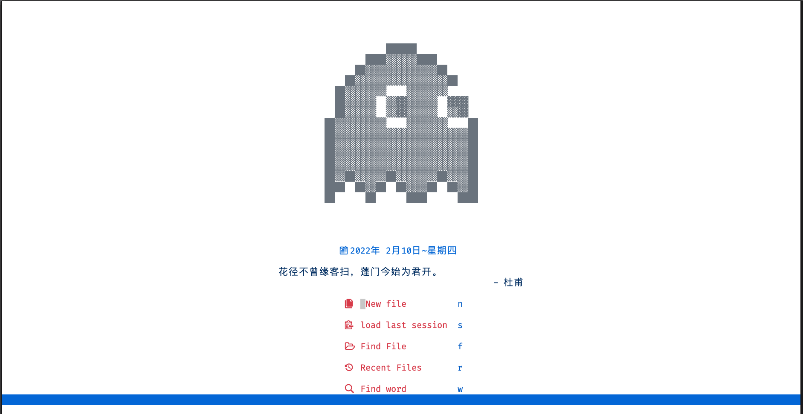
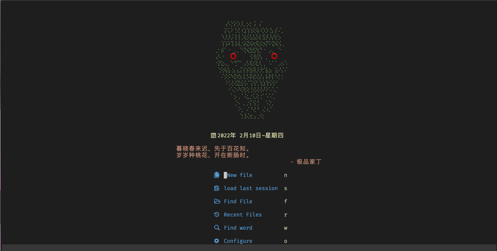
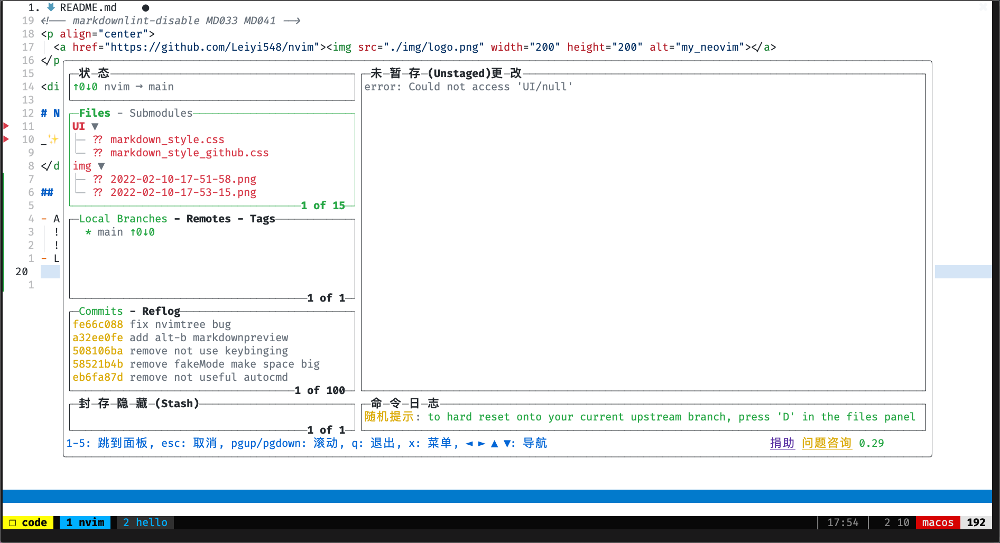
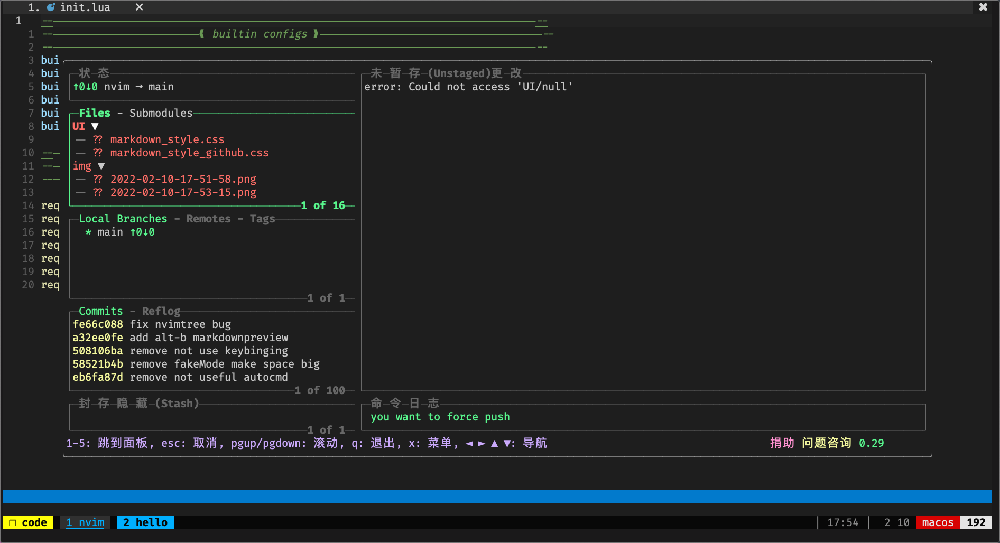

<p align="center">
  <a href="https://github.com/Leiyi548/nvim"></a>
</p>

<div align="center">

# Neovim

_✨ neovim lua config ✨_

</div>

## Install

<details>
  <summary><strong>Prerequisites</strong> <small><i>(🔎 Click to expand/collapse)</i></small></summary>

- [Neovim](https://github.com/neovim/neovim) >= 0.6.0
  ```shell
  brew install neovim --HEAD
  ```
- [ripgrep](https://github.com/BurntSushi/ripgrep)
  ```shell
  brew install ripgrep
  ```
- [fd](https://github.com/sharkdp/fd)
  ```shell
  brew install fd
  ```
- [NodeJS](nodejs-install) >= v16.13.0 most language servers need this
  ```shell
  brew install node
  ```
- [Lazygit](https://github.com/jesseduffield/lazygit)
  ```shell
  brew install lazygit
  ```

```shell
mv ~/.config/nvim ~/.config/nvim_bakcup
git clone https://github.com/Leiyi548/nvim.git ~/.config/nvim
nvim # run :PackerSync
```

  </details>

<details>
  <summary><strong>Recommended download</strong> <small><i>(🔎 Click to expand/collapse)</i></small></summary>

### Recommended Font

- [FiraCode Nerd Font](https://github.com/tonsky/FiraCode/blob/master/README_CN.md): My preferred font
- Any of the [Nerd Fonts]

On macOS with Homebrew, choose one of the [Nerd Fonts],
for example, here are some popular fonts:

```shell
brew tap homebrew/cask-fonts
brew search nerd-font
brew install --cask font-fira-code-nerd-font
brew install --cask font-victor-mono-nerd-font
brew install --cask font-iosevka-nerd-font-mono
brew install --cask font-hack-nerd-font
```

### Recommended Linters

```shell
### cpp file
# For .cpp file check linter error
brew install cppcheck
# For .cpp file format
brew install clang-format
### end cpp file

### python file
# For .py file check linter error
brew install flake8
# For .py file format
brew install black
### end python file

### lua file
# For .lua file format
brew install stylua
```

</details>

## Overview

<details>
  <summary>
    <strong>Screenshots</strong>
    <small><i>(🔎 Click to expand/collapse)</i></small>
  </summary>

- Alpha (Dashboard)
  
  
- Lazygit
  
  

</details>

## TODO

### plugins

- [ ] [orgmode.nvim](https://github.com/nvim-orgmode/orgmode)
- [ ] [harpoon](https://github.com/ThePrimeagen/harpoon)
- [x] [telescope-file-browser.nvim](https://github.com/nvim-telescope/telescope-file-browser.nvim)
- [x] [todo-comments.nvim](https://github.com/folke/todo-comments.nvim)

### language development

- [ ] HTML
- [ ] Javascript
- [ ] Typescript
- [x] Python

## Other Neovim configurations

- [LunarVim](https://github.com/LunarVim/LunarVim)
- [Nvchad](https://github.com/NvChad/NvChad)
- [Allen191819/neovim](https://github.com/Allen191819/neovim)
- [denstiny/nvim-nanny](https://github.com/denstiny/nvim-nanny)
- [ChristianChiarulli/nvim](https://github.com/ChristianChiarulli/nvim)
- [ayamir/nvimdots](https://github.com/ayamir/nvimdots)
- [DoomVim](https://github.com/NTBBloodbath/doom-nvim)
- [SpaceVim](https://github.com/SpaceVim/SpaceVim)
